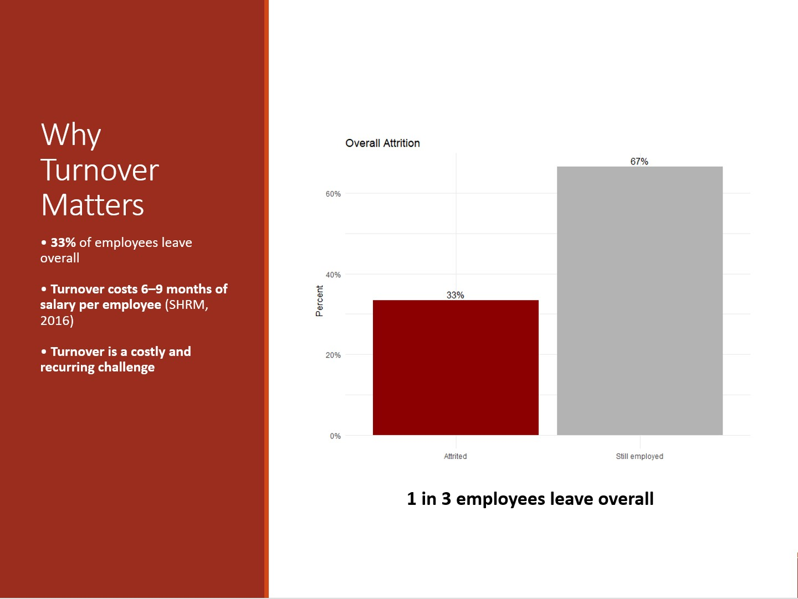
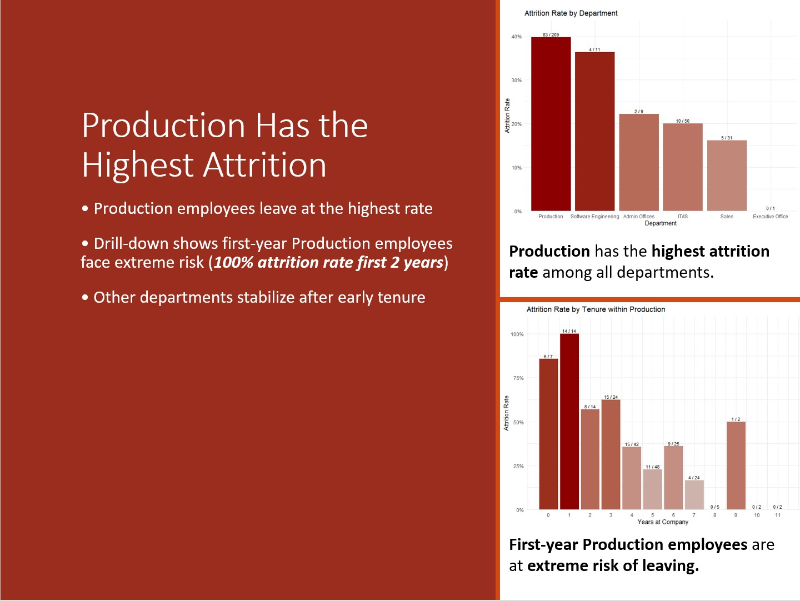
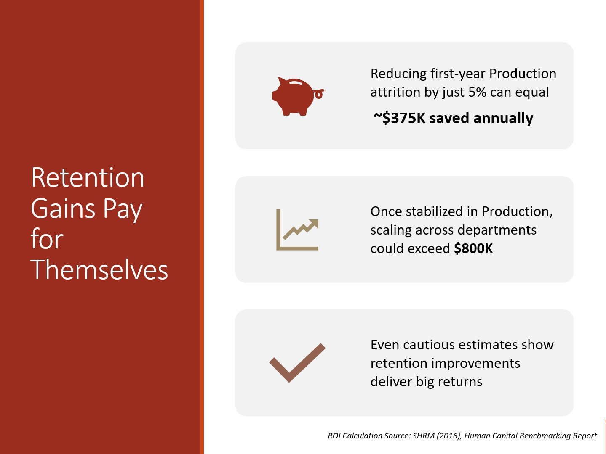

# 👥 HR Turnover Analysis (R Project)


---

## 🧠 Project Overview
This project explores **employee turnover patterns** within a dataset of **311 employees** to identify the key drivers of attrition and estimate potential cost savings from targeted interventions.  
Analyses were performed in **R** using tidyverse libraries, with results summarized in an interactive RMarkdown report and presentation deck.

---

### 🔍 Key Findings
- **Tenure** emerged as the **strongest predictor of turnover**, followed by **department type and job role**.  
- **First-year Production employees** were at the **highest risk** of leaving the organization.  
- ROI simulation estimated that a **5% reduction in first-year Production attrition** could yield **annual savings of ~$375K**.  
- Results highlight the need for improved **onboarding, job-fit, and early engagement strategies**.

---

## ⚙️ Tools & Techniques Used
- **R (tidyverse, dplyr, ggplot2, janitor, lubridate)** – data cleaning, wrangling, and visualization  
- **RMarkdown** – reproducible reporting and executive summaries  
- **PowerPoint** – communicating ROI and strategic recommendations  

---

## 🧩 Dataset Description
**Source:** [Human Resources Data Set – Kaggle](https://www.kaggle.com/datasets/rhuebner/human-resources-data-set)  
**Author:** Richard Huebner  
**License:** Public dataset available for educational and analytical use  

The dataset contains employee demographic, job, and performance variables used to model turnover risk.  
[Download Dataset](./data/hr_dataset_v14.csv)

---

## 📊 Presentation Highlights

<h3 align="center">Why Turnover Matters</h3>
<p align="center">
  
</p>

<h3 align="center">Production Has the Highest Attrition</h3>
<p align="center">
  
</p>

<h3 align="center">Retention Gains Pay for Themselves</h3>
<p align="center">
  
</p>

---

## 📈 Deliverables
- 📄 [RMarkdown Report (RPubs)](https://rpubs.com/oriontran/hr_turnover_analysis)  
- 📊 [Presentation Slides (PowerPoint)](./output/hr_turnover_analysis_slides.pptx)

---

```
## 📚 File Structure
HR_Turnover_R/
│
├── 📂 data/
│ └── hr_dataset_v14.csv
│
├── 📂 images/
│ ├── slide_2_turnover_matters.jpg
│ ├── slide_4_highest_attrition.jpg
│ └── slide_5_retention_gains.jpg
│
├── 📂 output/
│ ├── hr_turnover_analysis.html
│ ├── hr_turnover_analysis.md
│ └── hr_turnover_analysis_slides.pptx
│
├── hr_turnover_analysis.R
├── hr_turnover_analysis.Rmd
└── README.md
```

---

_Created by **Orion Tran** as part of a personal data analytics portfolio using R and RMarkdown._