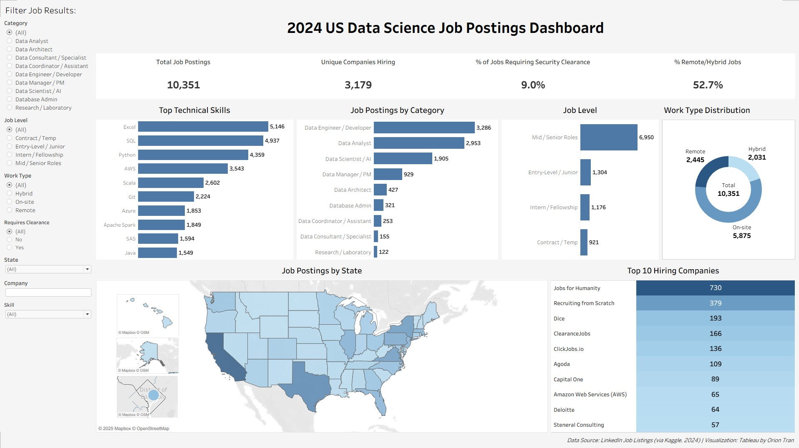

## 🧠 2024 US Data Science Job Postings Dashboard



### 📘 Overview

This Tableau dashboard visualizes over **10,000 U.S. data science job postings** sourced from **LinkedIn (via Kaggle, 2024)**.
I created it to explore which **roles, skills, and companies dominate the data science job market**, while showcasing my ability to perform data cleaning, transformation, and interactive dashboard design in Tableau.

---

### 🎯 Project Goals

* Identify **top hiring companies** and **most common job categories**
* Map **job distribution by state** across the U.S.
* Compare **work types** (on-site, hybrid, remote) and **job levels**
* Highlight **in-demand technical skills** across the data industry

---

### 🧩 Process Summary  

**Data Preparation (Excel & Power Query)**  
* Imported multiple CSVs from a Kaggle dataset containing LinkedIn data-science job postings  
* Performed all **data cleaning and transformation** in Power Query, including:  
  * Text filtering and classification of job summaries into standardized categories (e.g., *Data Analyst, Data Engineer / Developer, Data Scientist / AI*)  
  * Creation of calculated columns for **Work Type**, **Job Category**, and **Job Level**  
  * Handling missing and null values, trimming inconsistent text, and removing duplicates  
  * Mapping U.S. state abbreviations to full names, labeling unknown or remote listings as *“United States (Unlisted)”*  
* Consolidated and exported the cleaned dataset (`cleaned_data.xlsx`) for use in Tableau  

**Dashboard Design (Tableau Public)**  
* Designed a structured dashboard layout with:  
  * **KPI cards** summarizing total postings, unique companies, % remote/hybrid, and % requiring clearance  
  * **Bar charts** displaying job distribution by category, level, and technical skills  
  * **U.S. map visualization** for geographic distribution, including insets for Alaska, Hawaii, and D.C.  
  * **Company ranking table** showing top hiring organizations  
* Applied a **consistent blue palette**, added **in-bar labels**, and removed unnecessary gridlines for a clean, modern presentation  
* Included a **footer note** crediting LinkedIn and Kaggle as data sources and identifying the dashboard author  

---

### 🛠️ Tools & Skills  

* **Power Query (Excel)** – Data cleaning, text filtering, and calculated column creation for job classification and data standardization (ETL)  
* **Tableau Public** – Interactive dashboard design, KPI visualization, and map-based geographic analysis  
* **Data Preparation** – Extracting, transforming, and merging multiple CSVs into a single standardized dataset  
* **Dashboard Design & Storytelling** – Visual hierarchy, cohesive layout, and consistent design structure  
---

### 📁 Project Files

```
tableau-us-data-science-jobs/
│
├── 📂 data/
│   ├── job_postings_raw.csv
│   ├── job_skills_raw.csv
│   ├── job_summary_raw.csv
│   └── cleaned_data.xlsx
│
├── 📂 dashboard/
│   └── us_data_jobs_dashboard.twbx
│
├── 📂 images/
│   └── dashboard-screenshot.png
│
└── README.md
```

---

### 🌐 View the Dashboard

🔗 [View on Tableau Public](https://public.tableau.com/app/profile/orion.tran8284/viz/2024USDataScienceJobPostingsDashboard/Dashboard1)

---

### 🧾 Data Source

> Data Science Job Postings & Skills (2024) (https://www.kaggle.com/datasets/asaniczka/data-science-job-postings-and-skills/data)

---

_Created by **Orion Tran** as part of a personal data visualization portfolio using Tableau and Power Query._
