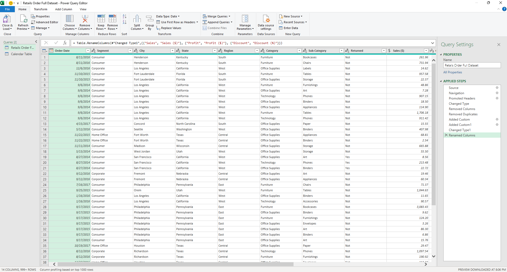
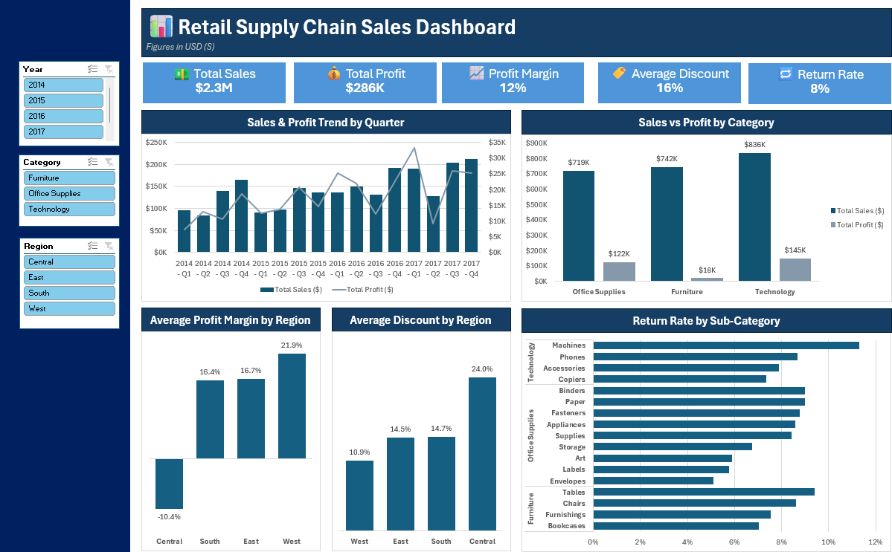
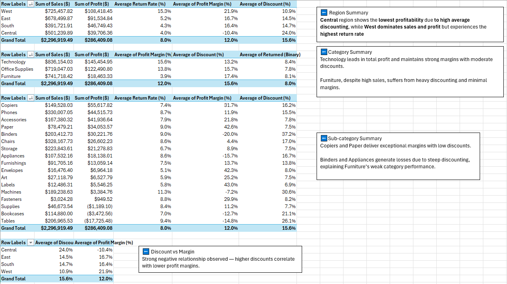

# 📊 Retail Sales Performance Dashboard (Excel Project)

---

## 🧠 Project Overview
This project analyzes **retail sales performance** across U.S. regions, product categories, and time periods using Excel and Power Query.  
The goal was to identify which regions and categories drive profitability and where discounting or returns reduce margins.

The final deliverable is an **interactive Excel dashboard** featuring dynamic slicers, KPI cards, and trend visualizations.

---

### 🔍 Key Findings
- **West Region** leads in sales and profit but faces the **highest return rate (15%)**.  
- **Central Region** operates at a loss due to **heavy discounting (24%)**.  
- **Technology** drives profitability, while **Furniture** underperforms despite high sales.  

---

## ⚙️ Tools & Skills Used
- **Excel & Power Query** – Data cleaning, transformation, and KPI creation  
- **PivotTables & Data Model** – Relationship modeling (Calendar Table, one-to-many)  
- **Descriptive Analytics** – Sales, profit, margin, and discount metrics  
- **Dashboard Design & Storytelling** – KPI cards, slicers, and dynamic visuals  

---

## 🧩 Dataset Description
**Source:** [Retail Supply Chain Sales Dataset – Kaggle](https://www.kaggle.com/datasets/shandeep777/retail-supply-chain-sales-dataset)  
**Author:** Shandeep777  
**License:** Public dataset available on Kaggle for educational and analytical use  

This dataset contains ~10,000 transactional records from a retail supply chain environment.  
It includes fields for order dates, regions, product categories, sub-categories, sales, discounts, profits, and returns.  

**Tables:**
- `Retails Order Full Dataset` — main transactional fact table  
- `Calendar Table` — continuous date lookup for time-series analysis  

**Key Variables:** Order Date, Region, Category, Sub-Category, Sales, Quantity, Discount, Profit, Returned  

> Note: The dataset was cleaned and transformed using Power Query in Excel to remove unused fields, correct data types, and calculate key metrics (Profit Margin, Returned Flag).

---

## 🧹 Data Preparation Summary
Data cleaning and transformation were performed entirely in **Power Query**:
- Promoted headers, verified data types, and removed irrelevant columns.  
- Created custom columns:  
  - `Profit Margin` = Profit / Sales  
  - `Returned (Binary)` = if Returned = "Yes" then 1 else 0  
- Ensured no missing or duplicate records.  
- Loaded both tables to the data model and created a date relationship.

The visual below summarizes applied steps in Power Query before dashboard creation:

  

➡️ See full process in [documentation_log.md](./documentation_log.md)

---

## 📊 Dashboard Features

### KPIs
- **Total Sales ($)**
- **Total Profit ($)**
- **Average Profit Margin (%)**
- **Average Discount (%)**
- **Return Rate (%)**

### Interactive Components
- **Slicers:** Year, Category, Region  
- **Charts:**  
  - Sales & Profit by Quarter (trend)  
  - Sales vs Profit by Category  
  - Average Profit Margin by Region  
  - Average Discount by Region  
  - Return Rate by Sub-Category  

---

## 🧠 Key Insights

**Regional Performance**  
- **West Region** leads in sales and profit but faces the highest return rate (~15%).  
- **Central Region** operates at a loss due to high discounting (24%).  
- **East & South** maintain steady profits with moderate discounts.

**Category Trends**  
- **Technology** drives profitability with strong margins (~16%).  
- **Furniture** underperforms despite high sales — heavy discounts hurt profit.  
- **Office Supplies** remains stable and balanced.

**Sub-Category Highlights**  
- **Copiers** and **Paper** achieve the highest margins with low discounts.  
- **Binders** and **Appliances** are loss leaders due to deep discounts.

---

## 📈 Dashboard Preview

<h3 align="center">Main Dashboard</h3>

  

<h3 align="center">EDA Sheet</h3>

  

---

## 🏁 Results & Takeaways
- Lower discounting consistently increases profit margins.  
- Discounting has a larger impact on profitability than product returns.  
- **West + Technology** are the strongest performance combination.  
- **Central + Furniture** require pricing and cost-control interventions.

---

## 📚 File Structure
excel_sales_dashboard/
│
├── 📂 screenshots/
│ ├── dashboard_preview.png
│ └── eda_pivots.png
│
├── documentation_log.md
├── excel_sales_dashboard.xlsx
├── retail_supply_chain_sales_dataset.xlsx
└── README.md

---

_Created by **Orion Tran** as part of a personal data visualization portfolio._